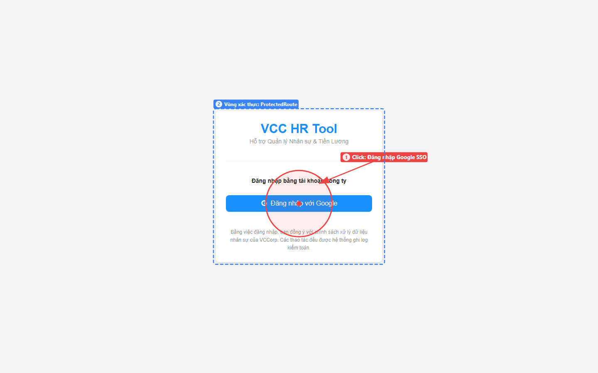
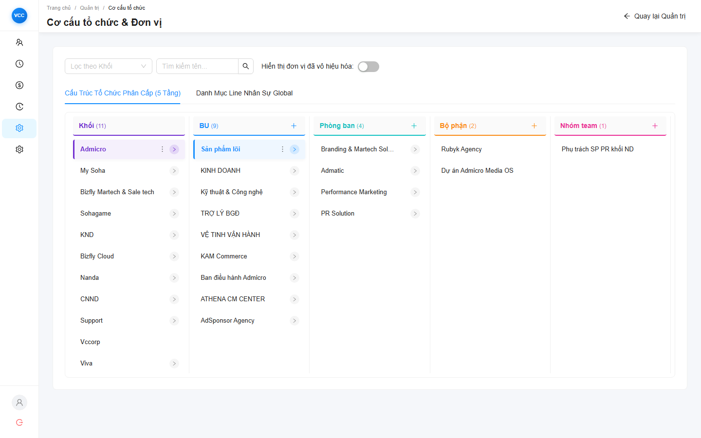
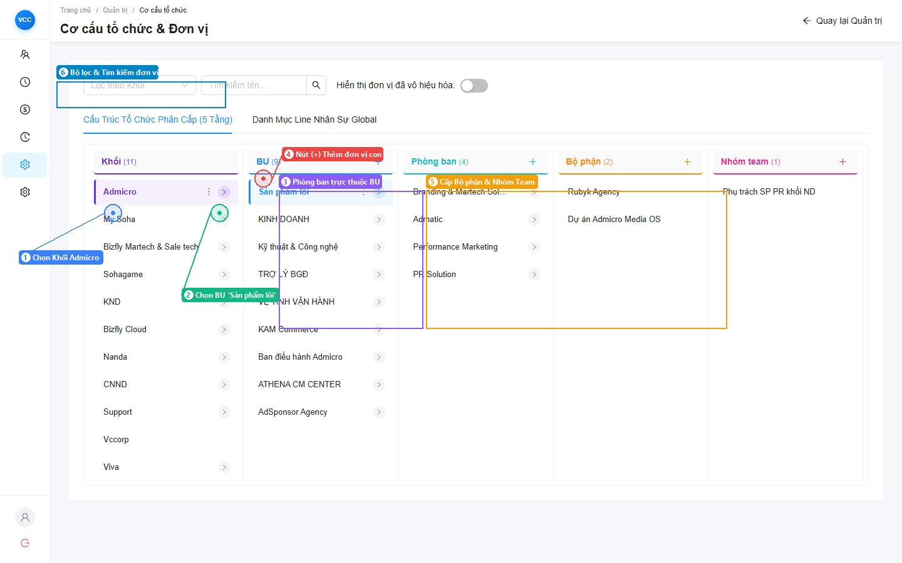
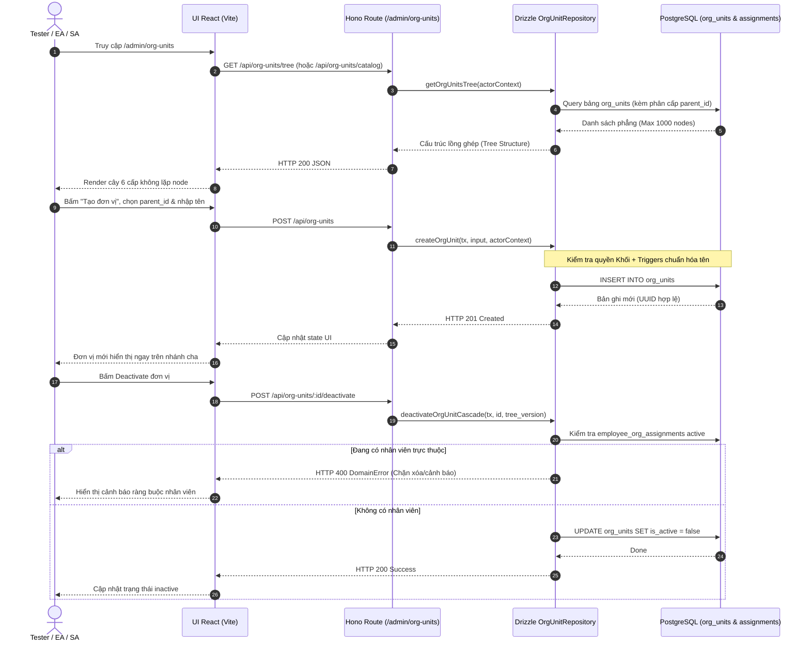

# Tài Liệu Kỹ Thuật & Kịch Bản Kiểm Thử: Cơ Cấu Tổ Chức & Đơn Vị (OrgUnits)

> **Dự án nguồn**: `Module_NhanSu_moi`  
> **Luồng nghiệp vụ**: Luồng 1 - Cơ cấu Tổ chức & Đơn vị (`OrgUnits`)  
> **Kế thừa kiến trúc**: Master Plan Phase 6 (Migration 048, 052, 067→088, Drizzle TypeScript OrgUnit Repository)  
> **Tài liệu tham chiếu**: [FEATURE_PLAN.md](file:///D:/Project_VCC/Module_NhanSu_moi/.agents/active/dev-ui-workflow-testing/FEATURE_PLAN.md), `docs/business-flows/01-tao-moi-nhan-su.md`

---

## 1. Tổng Quan (Overview)

### 1.1. Mục tiêu luồng
Luồng **Cơ cấu Tổ chức & Đơn vị (`OrgUnits`)** chịu trách nhiệm quản lý mô hình cây phân cấp đơn vị 6 cấp trong toàn hệ thống nhân sự VCC:
1. **Cấp 1 - Khối (`khoi`)**: Cấp cao nhất quản lý quyền hạn dữ liệu (EA, SA, VI, VA).
2. **Cấp 2 - Khối Doanh nghiệp / Ban / Trung tâm (`bu`)**.
3. **Cấp 3 - Phòng ban (`phong_ban`)**.
4. **Cấp 4 - Bộ phận (`bo_phan`)**.
5. **Cấp 5 - Tổ / Nhóm / Team (`nhom_team`)**.
6. **Cấp 6 - Line nhân sự (`line_nhan_su`)**.

Phân hệ này đảm bảo tính nhất quán dữ liệu cho toàn bộ các quy trình nghiệp vụ hạ tầng phía sau: Onboarding tuyển mới, Điều chuyển nhân sự (Temporal Assignment), Lọc bảng lương theo khối, và Chốt danh sách Snapshot hàng tháng.

### 1.2. Các Actor tham gia
* **SuperAdmin (SA)**: Toàn quyền tạo, sửa tên, di chuyển nhánh (reparent), kích hoạt / ngừng kích hoạt (activate / deactivate cascade) trên mọi Khối.
* **Executive Admin (EA)**: Quyền thao tác trong phạm vi các Khối được gán quyền.
* **Viewer (VI) / Viewer All (VA)**: Chỉ có quyền xem cấu trúc cây tổ chức, không được chỉnh sửa.

---

## 2. Giao Diện Xác Thực & Cổng Truy Cập (UI Dev Testing)

Đường dẫn kiểm thử: [https://vcc-hr-frontend-dev-69050732080.asia-southeast1.run.app/admin/org-units](https://vcc-hr-frontend-dev-69050732080.asia-southeast1.run.app/admin/org-units)

Hệ thống triển khai cơ chế `<ProtectedRoute>` bảo vệ các trang quản trị (`/admin/*`). Khi chưa được cấp phiên đăng nhập, hệ thống tự động hiển thị màn hình đăng nhập công ty tích hợp Google SSO:

### Giao diện thực tế cây cơ cấu tổ chức phân cấp (Live UI)
Dưới đây là hình ảnh thực tế ghi nhận qua kiểm thử tự động, minh họa quy trình mở rộng từ cấp Khối -> BU -> Phòng ban -> Bộ phận -> Nhóm team:

---

## 3. Kiến Trúc & Sơ Đồ Xử Lý (Architecture & Workflow)

Toàn bộ các stored procedures cũ (`rpc_create_org_unit`, `rpc_assign_org_unit`...) đã được chuyển dịch hoàn toàn sang **Drizzle TypeScript Repository** (`backend/src/modules/org-units/org-unit.repository.ts`), chạy trong atomic transaction `tx: DbOrTx`.

---

## 3. Các API Endpoints Trọng Yếu

| Method | Endpoint | Mô tả | Quyền tối thiểu | Payload chính / Ghi chú |
| :--- | :--- | :--- | :--- | :--- |
| `GET` | `/api/org-units/tree` | Lấy toàn bộ cây tổ chức | VI, EA, SA | Trả về JSON cây đệ quy phân cấp |
| `GET` | `/api/org-units/catalog` | Danh mục đơn vị phẳng | VI, EA, SA | Hỗ trợ lọc theo `khoi`, `type`, `is_active` |
| `POST` | `/api/org-units` | Tạo đơn vị tổ chức mới | EA (thuộc khối), SA | `{ name, type, parent_id, code? }` |
| `PATCH` | `/api/org-units/:id` | Sửa tên/thông tin đơn vị | EA (thuộc khối), SA | `{ name, code? }` kích hoạt normalize trigger |
| `POST` | `/api/org-units/:id/deactivate`| Ngừng kích hoạt đơn vị | SA | Kiểm tra cascade guard nhân viên active |
| `POST` | `/api/org-units/:id/reparent` | Đổi nhánh cha (di chuyển) | SA | `{ new_parent_id, effective_date }` |

---

## 4. Kịch Bản Kiểm Thử Chi Tiết Trên UI Dev

### Kịch bản 1.1: Xem cây cơ cấu tổ chức phân cấp
* **Route UI**: `/admin/org-units`
* **Mục tiêu**: Kiểm tra tính toàn vẹn của cây tổ chức thực tế (626 đơn vị).
* **Các bước thực hiện**:
  1. Đăng nhập với quyền `SA` hoặc `EA`.
  2. Mở menu hoặc truy cập đường dẫn `/admin/org-units`.
  3. Mở rộng (expand) lần lượt từ cấp Khối -> Ban/TT -> Phòng -> Tổ/Nhóm.
* **Kết quả mong đợi (Expected Outcome)**:
  - Cây hiển thị mượt mà, không bị crash trang (không gặp `Maximum update depth exceeded` hoặc đệ quy vô hạn).
  - Không có node bị lặp lại hoặc gãy nhánh cha-con.
  - Số lượng hiển thị đúng với danh mục 626 đơn vị trong database.

### Kịch bản 1.2: Tạo mới đơn vị con
* **Route UI**: `/admin/org-units`
* **Mục tiêu**: Đảm bảo tạo mới đơn vị lưu đúng vào DB và đồng bộ lên cây UI ngay lập tức.
* **Các bước thực hiện**:
  1. Chọn 1 Khối cha (hoặc 1 Ban/TT cha).
  2. Bấm nút **"Thêm đơn vị con"**.
  3. Điền thông tin:
     - Tên đơn vị: `Phòng Thử Nghiệm UI Dev`
     - Loại đơn vị: `phong_ban` (hoặc cấp tương ứng).
  4. Bấm **Lưu / Tạo**.
* **Kết quả mong đợi**:
  - Giao diện phản hồi thành công, đơn vị mới xuất hiện ngay dưới nhánh cha đã chọn.
  - Kiểm tra Network Tab (F12): API trả về `201 Created` kèm UUID hợp lệ.
  - Tên đơn vị tự động được chuẩn hóa khoảng trắng thừa (Trigger `fn_trg_org_units_normalize_name`).

### Kịch bản 1.3: Chỉnh sửa thông tin đơn vị
* **Route UI**: `/admin/org-units`
* **Mục tiêu**: Kiểm tra cập nhật thông tin và kích hoạt chuẩn hóa.
* **Các bước thực hiện**:
  1. Chọn đơn vị vừa tạo `Phòng Thử Nghiệm UI Dev`.
  2. Bấm nút **Chỉnh sửa (Edit)**.
  3. Sửa tên thành: `Phòng Thử Nghiệm UI Dev (Updated)`.
  4. Bấm **Lưu**.
* **Kết quả mong đợi**:
  - Tên hiển thị trên cây cập nhật ngay lập tức mà không cần reload toàn bộ trang.

### Kịch bản 1.4: Kiểm tra Cascade Deactivation Guard (Ngừng kích hoạt an toàn)
* **Route UI**: `/admin/org-units`
* **Mục tiêu**: Ngăn chặn tình trạng xóa nhầm/ngừng kích hoạt đơn vị đang có nhân sự làm việc.
* **Các bước thực hiện**:
  - **Case A (Đơn vị rỗng)**: Chọn đơn vị `Phòng Thử Nghiệm UI Dev` vừa tạo (chưa có nhân viên nào) -> Bấm **Ngừng kích hoạt (Deactivate)**.
    - *Kết quả*: Thành công, trạng thái chuyển sang Inactive (hoặc biến mất khỏi cây active).
  - **Case B (Đơn vị đang có nhân sự)**: Chọn một phòng ban thực tế đang có nhân viên (ví dụ: Phòng Kế toán hoặc Dev).
    - Bấm **Ngừng kích hoạt (Deactivate)**.
    - *Kết quả*: Hệ thống chặn lại, hiển thị thông báo lỗi/cảnh báo rõ ràng: *"Không thể ngừng kích hoạt đơn vị đang có nhân viên trực thuộc"* (`DomainError: ERR_ORG_CASCADE_ACTIVE_EMPLOYEES`).

---

## 5. Các Rủi Ro Kỹ Thuật Trọng Yếu (P6 Technical Checkpoints)

1. **Truy vấn Đệ quy & Vấn đề N+1 Query**:
   - Truy vấn cây tổ chức phải sử dụng truy vấn cây phẳng hoặc CTE đệ quy, giới hạn trần `ORG_UNIT_MAX_ROWS = 1000`.
   - Tuyệt đối không gọi loop query cho từng node con trên giao diện.
2. **Khóa Ngoại và Ràng Buộc Phân Cấp**:
   - `parent_id` phải cùng `khoi` với node cha. Không cho phép một Phòng ban thuộc Khối A lại có `parent_id` trỏ sang Khối B.
3. **Mô Hình Gán Lịch Sử (`employee_org_assignments`)**:
   - Các thay đổi cấu trúc cây phòng ban không được làm mất lịch sử công tác của nhân sự (bảo toàn mô hình Temporal Assignment `valid_from` / `valid_to`).
